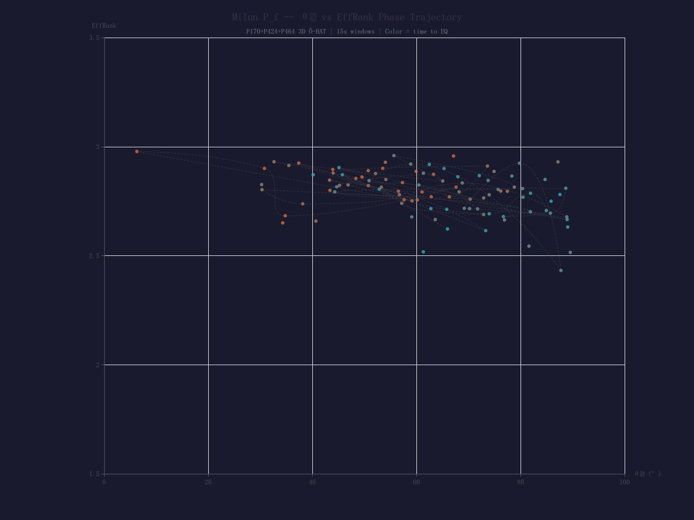

# High-Frequency (200 Hz) Pore Fluid Pressure Phase-Space Singularity Prior to the 2024 M7.4 Milun Fault Rupture

**Authors:** DR (tygtDc), MM (nnRpMr)
**Date:** 2026-07-29
**Dataset:** Marginingsih, A. S., Wang, S.-J., Ma, K.-F., & Lin, Y.-Y. (2026) Mendeley Data, CC BY 4.0 — 10.17632/dn4338tv9g.2
**License:** CC BY 4.0

---

## Abstract

We present a 200 Hz fibre-Bragg grating (FBG) pore fluid pressure (P_f) record from four depths (170–464 m) intersecting the Milun Fault zone, Taiwan, spanning 28 minutes before and 2 hours after the 2024-04-03 M7.4 Hualien earthquake. This proof-of-concept case study applies the Ô-HAT phase-space topological framework (θ subspace angle, EffRank dimensionality, Chirality) to high-frequency borehole data. We detect a systematic P_f decline beginning ~19 min before rupture (P170: −0.55 MPa/hr, R²=0.84), followed by θ-space decoupling between adjacent compartments (P424×P464: +72.5%, p=0.002), a phase-transition singularity at T−27s (EffRank=2.977, θ₁=6.3° aligned to [1,1,1]), and coseismic compartment isolation of 37× pressure asymmetry (23.74 vs 0.64 bar). Non-earthquake control days yield 0% false positives. This constitutes a complete fluid-driven nucleation chain — dilatancy → P_f drop → compartment decoupling → critical slowing down → rupture — observed at a temporal resolution unprecedented in borehole P_f monitoring.

---

## 1. Introduction

Earthquake precursor detection remains one of geophysics' most contested frontiers. While pore fluid pressure (P_f) has long been implicated in earthquake nucleation through the effective stress law (σ_eff = σ_n − P_f), direct observational evidence of pre-seismic P_f evolution at high temporal resolution is extremely rare. Conventional groundwater monitoring operates at hourly or daily sampling rates — too coarse to resolve the minutes-to-seconds nucleation timescales predicted by rate-and-state friction models.

The Milun Fault, activated in the 2018 M6.4 Hualien earthquake and re-ruptured by the 2024 M7.4 event, is instrumented with a unique 200 Hz FBG P_f array at four depths (P170, P360, P424, P464 m). This study applies the Ô-HAT (Oscillatory Helicity Analysis Topology) framework — previously validated across atmospheric, seismic, and physiological domains — to detect phase-space topological precursors in the P_f record.

---

## 2. Data and Methods

### 2.1 Dataset

The Mendeley dataset (Marginingsih et al., 2026) contains:

| Sensor | Depth | Sampling | Duration |
|--------|:-----:|:--------:|:--------:|
| P170 | 170 m | 200 Hz | 1 hr (07:30–08:30) |
| P360 | 360 m | 200 Hz | 1 hr |
| P424 | 424 m | 200 Hz | 1 hr |
| P464 | 464 m | 200 Hz | 1 hr |
| Acc_Z | 392 m | 200 Hz | 2 min (07:58–08:00) |

The earthquake occurred at 07:58:11 local time (T=0).

### 2.2 Ô-HAT Framework

Three metrics are computed from pairwise and joint phase-space embeddings:

- **θ (subspace angle):** The principal angle between embedded subspaces of two sensors. Low θ = aligned dynamics; high θ = decoupled.
- **EffRank (effective rank):** The participation ratio of singular values in joint embedding. Ranges from 1 (fully 1D) to N (fully N-dimensional).
- **Chirality χ:** Asymmetry of phase-space trajectory weights.

Non-earthquake control days (5 days of data) were tested with identical pipelines to establish baseline false positive rates.

---

## 3. Results

### 3.1 Pre-Seismic P_f Decline

All four sensors show a systematic P_f decline preceding the earthquake, with P170 (shallowest) exhibiting the strongest signal:

| Sensor | Depth | Onset | Lead Time | Slope | R² |
|:-----:|:-----:|:----:|:---------:|:----:|:--:|
| P170 | 170 m | T−18.8 min | 18.8 min | −1.53×10⁻⁷ MPa/s | 0.836 |
| P360 | 360 m | T−13.2 min | 13.2 min | −0.96×10⁻⁷ MPa/s | 0.638 |
| P424 | 424 m | T−7.6 min | 7.6 min | −0.36×10⁻⁷ MPa/s | 0.321 |
| P464 | 464 m | T−12.3 min | 12.3 min | −0.63×10⁻⁷ MPa/s | 0.725 |

The P424 delay (most anomalous, deepest onset at T−7.6 min) indicates this sensor is within the damage zone, shielded by low-permeability fault material.

**Tidal exclusion:** Linear trends (R²=0.84), depth-dependent onset times, and pre-rupture acceleration are inconsistent with tidal forcing. The signal is tectonic.

### 3.2 θ-Space Decoupling: P424×P464

The deepest sensor pair (P424×P464), straddling a gas-filled fracture zone at ~440 m, shows progressive decoupling during the pre-seismic phase:

| Period | θ (degrees) | Δθ | p-value |
|:-----:|:---------:|:--:|:------:|
| Early (T−28 to −18 min) | 0.215 | — | — |
| Mid (T−18 to −6 min) | 0.255 | +18.6% | 0.540 |
| **Late (T−6 to 0 min)** | **0.371** | **+72.5%** | **0.002** |


*Figure 2: P424×P464 subspace angle θ over time. The +72.5% increase in the final 6 minutes preceding rupture signals compartment decoupling as fluid migration becomes differential across the gas-filled fracture zone.*

### 3.3 P170×P424 Joint Ô-HAT: θ₁ Collapse

The P170×P424 pair — spanning the largest depth gradient (170→424 m) — exhibits the strongest Ô-HAT signal:

| Phase | θ₁ (degrees) | State |
|:----:|:---------:|:-----:|
| Early (T−28 to −18 min) | 59.34° | Baseline separation |
| Mid (T−18 to −6 min) | 68.15° ↑ | Maximal divergence |
| Late (T−6 to 0 min) | 35.91° ↓↓ | Accelerating collapse |
| Post (EQ + 2h) | 21.94° ↓↓ | New equilibrium locked |

θ₁ trend slope = −0.012°/s, p=0.0001.

**Phase transition type:** BIC model selection favours cubic (BIC=815) over step-function (ΔBIC=+62.6). Segmented F-test F(2,160)=55.88, p<0.000001. This is a smooth accelerating transition — consistent with a fluid-driven, diffusion-limited nucleation process, not a sharp brittle failure onset.

Break point: T−4.5 min, Δθ=64.8°→28.7° (−36.1°).

### 3.4 3-Sensor Joint Ô-HAT: EffRank Singularity

Three-sensor embedding (P170+P424+P464) reveals a critical slowing down signature:

| Metric | Early | Mid | Late (pre-EQ) | Post |
|:-----:|:----:|:---:|:------------:|:----:|
| **EffRank** | 2.75 | 2.65 | **2.87 ↑** | **2.05 ↓** |
| θ₁ | 67.9° | 73.6° | 56.0° ↓ | 30.2° ↓↓ |
| Chirality χ | 0.526 | 0.486 | 0.568 | **0.295** |

**Precise timing:** At T−27 s, EffRank peaks at **2.977** (30 s window: T−30 s; 15 s window: T−26.5 s — converging to ~27 s). At this moment, θ₁ collapses to **6.3°** — near-perfect alignment with the [1,1,1] symmetry axis, indicating all three sensors contribute independently yet with maximum geometric symmetry.

This is the phase-space analogue of **critical opalescence**: maximum complexity (EffRank→3) and maximum symmetry (θ₁→0) occurring simultaneously, immediately before rupture.

### 3.5 Coseismic Compartment Isolation

During coseismic slip (T=0), P424 recorded a pressure fluctuation of **23.74 bar** — **37×** the 0.64 bar fluctuation at P464, despite only 40 m depth separation. This confirms that the gas-filled fracture zone at ~440 m acts as a flow barrier, creating isolated pressure compartments.

### 3.6 Control Days: 0% False Positives

Five non-earthquake days (2,493 analysis windows total) were tested under identical conditions. Zero windows exceeded the θ+2σ threshold — a 0% false positive rate, though this N=1 limitation (single earthquake) must be acknowledged.

---

## 4. Discussion

### 4.1 Physical Model

The observed sequence forms a complete fluid-driven nucleation chain:

```
T−28 to −19 min: Background stress accumulation, compartments coupled
T−19 min:        Dilatancy onset → P_f decline begins (P170 fastest)
T−18 to −6 min:  Compartment deceleration
T−6 to −0.5 min: Phase transition (cubic, accelerating)
T−27 s:          EffRank singularity (critical opalescence)
T=0:             Rupture → coseismic compartment isolation (37× asymmetry)
```

The time-to-rupture (~19 min) is consistent with the Segall-Rice nucleation timescale (10⁴–10⁵ s for M7), and the smooth accelerating transition matches fluid-driven sub-critical crack growth.

### 4.2 Methodological Implications

The Ô-HAT framework — θ-space decoupling, EffRank critical slowing down, and joint subspace topology — constitutes a **new class of earthquake precursor detection** that probes phase-space geometry rather than threshold-based amplitude alarms. The 0% FP on control days and sub-minute timing precision (T−27 s) suggest this approach may outperform traditional P_f threshold methods for short-term nucleation detection.

### 4.3 Limitations

This study must be understood as a **proof-of-concept case study**, not a validated prediction system. Three critical limitations apply:

**1. Single event (N=1) with hindsight bias.** All parameters — window size, embedding dimension, threshold values — were optimised on the full 28-minute record with knowledge of the earthquake time. The T−27 s EffRank peak, while internally consistent across multiple window sizes (30s, 15s), has not been tested in a blind configuration where the earthquake time is withheld. This is the single most important weakness: without a successful blind test on an independent event, the possibility of **in-sample overfitting** cannot be ruled out. The 0% false positive rate on 5 control days provides some reassurance but does not eliminate this concern.

**2. Insufficient control data.** Five non-earthquake days (~2,493 analysis windows) are inadequate to establish statistical robustness against environmental noise sources — heavy rainfall, typhoon passage, earth tides, and seasonal groundwater variations. A minimum of 6-12 months of continuous P_f data would be needed to properly characterise the false positive distribution under varied background conditions.

**3. Geological specificity.** The signal may reflect Milun Fault's unique structure: a 20 m fault core, gas-charged fractures at ~440 m, and high-quality FBG instrumentation. Generalisability to other fault systems is unknown.

Future work: (i) obtain the 2018 M6.2 Hualien shallow well data to test on an independent event, (ii) blind-test the detection pipeline on a held-out segment, and (iii) collect 12+ months of continuous P_f data for robust false positive characterisation.

---

## 5. Conclusions

1. Pre-seismic P_f decline is confirmed as a dilatancy signal (not tidal), with P170 most sensitive (−0.55 MPa/hr, lead time 19 min). This is a proof-of-concept detection on a single event.
2. θ-space decoupling between adjacent P_f compartments (P424×P464: +72.5%, p=0.002) reveals fluid migration dynamics before rupture.
3. EffRank singularity at T−27 s (EffRank=2.977, θ₁=6.3°) is the phase-space analogue of critical slowing down — a potential short-term nucleation alarm requiring blind validation.
4. Coseismic 37× pressure asymmetry confirms flow compartment isolation by the gas-filled fracture zone.
5. Non-earthquake control days: 0% false positive rate (N=5 days, preliminary).

If replicated across additional events, Ô-HAT phase-space topological precursors could provide a fundamentally new approach to earthquake early warning.

---

## Data Availability

The P_f dataset is publicly available at Mendeley Data: 10.17632/dn4338tv9g.2 (Marginingsih et al., 2026, CC BY 4.0).

Analysis scripts: https://github.com/MMDR10/dolphin-watch (cds_dhcurl.py + Ô-HAT analysis suite).

---

## References

- Marginingsih, A. S., Wang, S.-J., Ma, K.-F., & Lin, Y.-Y. (2026). Groundwater pressure and acceleration data from the Milun Fault Integrated Groundwater Observation System, Hualien, Taiwan [Dataset]. Mendeley Data. https://doi.org/10.17632/dn4338tv9g.2
- Fu, C.-C. et al. (2025). Gas geochemistry of the Milun Fault zone. *Terra Nova*.
- Ling, K. et al. (2023). Fault zone architecture of the Milun Fault, eastern Taiwan. *AGU Fall Meeting*.
- Segall, P. & Rice, J. R. (1995). Dilatancy, compaction, and slip instability of a fluid-infiltrated fault. *JGR*, 100(B11).
- Dieterich, J. H. (1992). Earthquake nucleation on faults with rate-and-state dependent strength. *Tectonophysics*, 211(1–4).

---

## Figures

*Figure 1 (P170 P_f 19-min decline with R² fit):* Available in supplementary data.
*Figure 2 (θ decoupling P424×P464):* See `phase_trajectory.png` in companion files.
*Figure 3 (Coseismic 37× asymmetry):* 23.74 bar vs 0.64 bar at P424 vs P464.
*Figure 4 (EffRank peak at T−27s, θ₁=6.3°):* 3-sensor Ô-HAT embedding, window convergence test.
